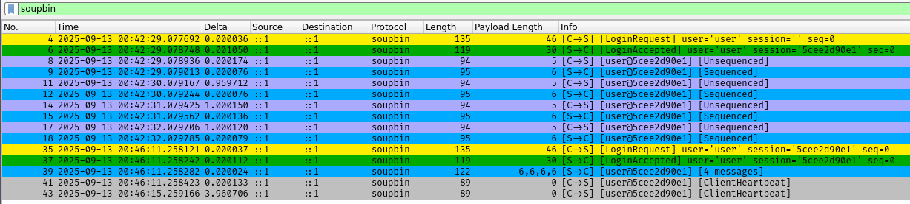

# soupbintcp
A C++ implementation of NASDAQ's SoupBinTCP protocol defined [here](https://www.nasdaq.com/docs/SoupBinTCP%204.0.pdf).

An example of a client connect, data transfer, and reconnect / replay:

## Examples
- [Server implementation](examples/server.cpp)
- [Client implementation](examples/client.cpp)
